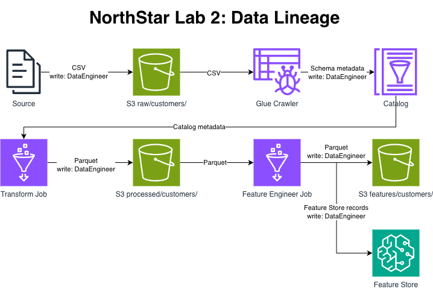

# NorthStar Retail AI
Code repository for CS 401R, *Engineering the AI Enterprise*, at BYU.

NorthStar Retail is a fictional specialty retailer with 400 stores across North America and a growing e-commerce presence with ~$3.2B annual revenue.

## AI Systems
| System | Type | Business Goal |
|---|---|---|
| Churn Prediction | Batch ML (XGBoost) | Identify at-risk customers 90 days before churn |
| Offer Generation | LLM / RAG | Personalize retention offers |
| Customer Service Agent | Agentic AI | Handle inquiries and escalations autonomously |

## Repository Structure
```
.
|-- data/raw/             Sample transaction data
|-- docs/                 Architecture, contracts, lineage, and run evidence
|-- glue-scripts/         Transform and feature engineering jobs
|-- infrastructure/
|   |-- environments/     LocalStack and live AWS configurations
|   \-- modules/          Reusable Terraform modules
|-- scripts/              Verification, setup, and teardown tools
|-- Makefile              Local validation commands
\-- docker-compose.yml    LocalStack services
```

## Lab 2: Data and Feature Engineering

The data pipeline loads raw transaction CSV files into S3, discovers their schema with AWS Glue, writes cleaned transactions as Parquet, and produces customer-level features in both S3 and SageMaker Feature Store.



The VPC module adds a private subnet and NAT Gateway for SageMaker and Glue. The IAM and storage modules add the DataEngineer and ModelMonitor roles, access boundaries, and S3 lifecycle rules. The Glue module creates the catalog database, crawler, private network connection, transform job, feature engineering job, and job script objects. The Feature Store module creates the 16-feature customer feature group with online and offline storage.

### Running the live pipeline

This requires Terraform, an authenticated AWS CLI, and `us-east-1` as the AWS region. The input may be any transaction CSV with the nine expected source columns. The included sample is the default example below.

Create or update the AWS infrastructure:

```bash
export AWS_DEFAULT_REGION=us-east-1
terraform -chdir=infrastructure/environments/dev init
terraform -chdir=infrastructure/environments/dev apply
```

Upload an input file and register its schema:

```bash
export INPUT_CSV=data/raw/northstar-raw-sample.csv
ACCOUNT_ID=$(aws sts get-caller-identity --query Account --output text)
BUCKET="northstar-dev-data-${ACCOUNT_ID}"

aws s3 cp "${INPUT_CSV}" "s3://${BUCKET}/raw/customers/$(basename "${INPUT_CSV}")"
aws glue start-crawler --name northstar-dev-raw-crawler
aws glue get-crawler --name northstar-dev-raw-crawler \
  --query 'Crawler.State' --output text
```

Wait for the crawler to return `READY`, then run the transform job and wait for `SUCCEEDED`:

```bash
aws glue get-table --database-name northstar_dev --name customers
TRANSFORM_RUN_ID=$(aws glue start-job-run \
  --job-name northstar-dev-transform \
  --query JobRunId --output text)
aws glue get-job-run \
  --job-name northstar-dev-transform \
  --run-id "${TRANSFORM_RUN_ID}" \
  --query 'JobRun.JobRunState' --output text
aws s3 ls "s3://${BUCKET}/processed/customers/" --recursive
```

Run feature engineering after the transform succeeds:

```bash
FEATURE_RUN_ID=$(aws glue start-job-run \
  --job-name northstar-dev-feature-engineer \
  --query JobRunId --output text)
aws glue get-job-run \
  --job-name northstar-dev-feature-engineer \
  --run-id "${FEATURE_RUN_ID}" \
  --query 'JobRun.JobRunState' --output text
aws s3 ls "s3://${BUCKET}/features/customers/" --recursive
aws sagemaker describe-feature-group \
  --feature-group-name northstar-dev-customer-features \
  --query FeatureGroupStatus --output text
```

The status commands may be repeated until the crawler or job reaches its successful state.

### Running locally

LocalStack validates the supported Terraform resources without creating a NAT Gateway. It does not run the managed Glue or Feature Store pipeline.

```bash
make local-validate LOCAL_OUT=docs/lab2-localstack-output.txt
make local-destroy
```

### Testing

The live verification script requires `pandas` and `pyarrow`. Run it while the AWS resources and pipeline outputs still exist:

```bash
bash scripts/verify-lab2.sh 2>&1 | tee docs/lab2-verify-output.txt
```

### Teardown

Save the live verification output before teardown. Plain `terraform destroy` is not sufficient because Glue, SageMaker, and versioned S3 resources exist outside Terraform state.

```bash
bash scripts/teardown-lab2.sh
```

The script writes `docs/lab2-destroy-output.txt` and verifies that no billable Lab 2 resources remain.
